# Modern Clinic app
---

## Vision

### “Modern Clinic” is web-application which allows users to get familiar with a new medical service, read about doctors and schedule an appoinment.

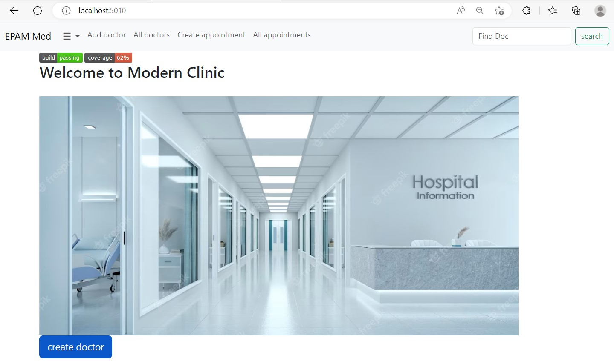

## Application should provide: 
* Storing appointment and doctor information in a database; 
* Display list of doctors; 
* Updating the list of doctors (adding, editing, removing);
* Display list of appointments;
* Updating the list of appointments (adding, editing, removing);  
* Display the current number of appointments and doctors;
* Search for the doctor by his/her name.

  

# ____ 1. Doctors ____

## 1.1 Display list of doctors.

The mode is designed to view the list of doctors, to display the total number of orders for a specified period of time.

### Main scenario: 
* User selects the item “all doctors” in the top panel;
* The application displays a list of Doctors.
* Above the doctor's table, *the total quantity* of personnel is calculated.  

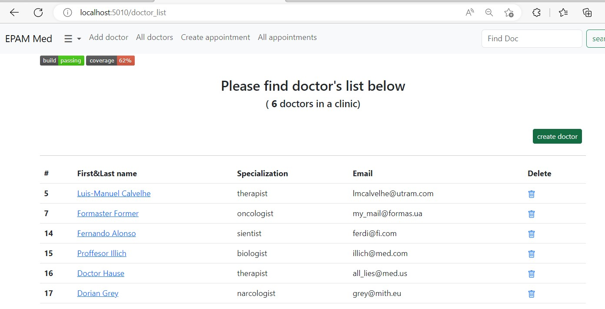

### The list displays the following columns:
* First&Last name - Doctors first name and last name;
* Specialization - the direction in which doctor works
* Email - his official contact email
* You can view/update a specific doctor by clicking on his/her name in a row. To delete the doctor - simply use a trash button at the end of a row.

## 1.2 Add a doctor.
### Main scenario:
* User clicks the “Add doctor” button in the main page/or list view mode;
* Application displays form to enter order data;
* User enters doctor data and press “Add doctor” button;
* If any data is entered incorrectly, incorrect data messages are displayed;
* If entered data is valid, then record is adding to database;
* If error occurs, then error message is displaying;
* If new order record is successfully added, then list of orders with added records is displaying.  

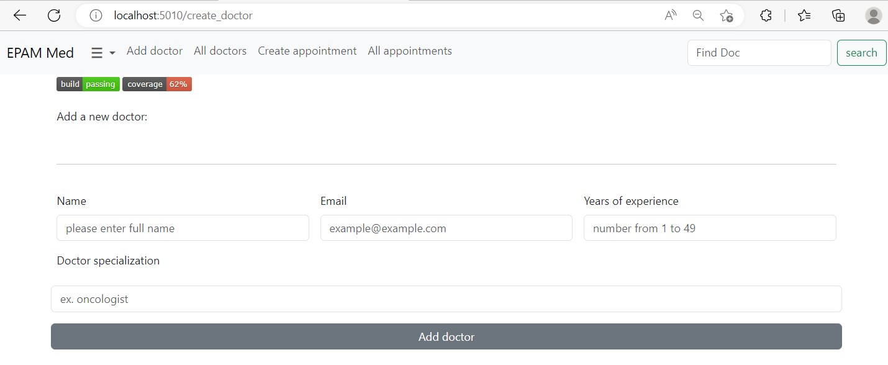

When adding an order, the following details are entered:
* Doctor’s name – doctor’s first and last name;
* Doctor’s email – doctor’s corporate email address;
* Experiense – Doctor’s experience in years;
* Specialiation – the field of his responsibilities.

## 1.3 Edit doctor.
### Main scenario:
* User clicks the on Doctors' NAME to open edit form;
* Application displays form to enter doctor’s data;
* User enters doctor data and presses “Update” button;
* If any data is entered incorrectly, incorrect data messages are displayed;
* If entered data is valid, then edited data is added to the database;
* If error occurs, then error message is displaying;
* If order record is successfully edited, then a list of doctors with adited records is displaying.  

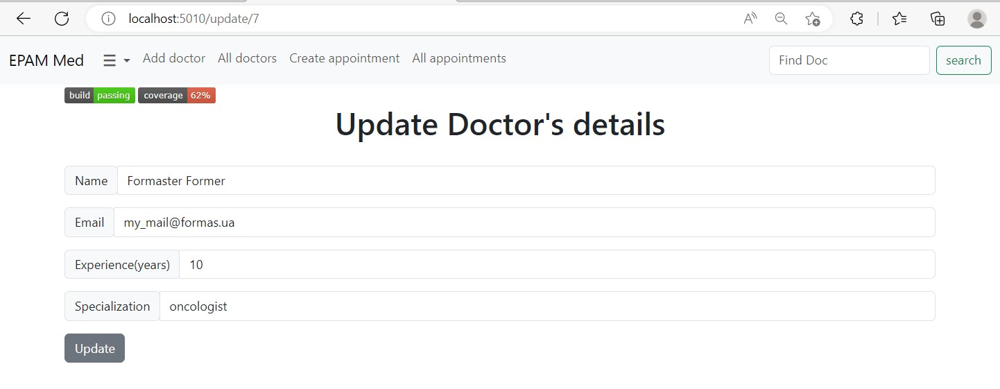

## 1.4 Removing the doctor

### Main scenario:
* The user, while in the list of orders, presses the "Delete" button in the selected order line;
* The user confirms the removal of the doctor by clicking the trash button;
* Record is deleted from database;
* If error occurs, then error message displays;
* If order record is successfully deleted, a flash message about deleting is displayed.
* If the order record is successfully deleted, then list of orders without deleted records is displaying.

---
#### a flash message _with Doctor's name_ will approve correct doctor removal
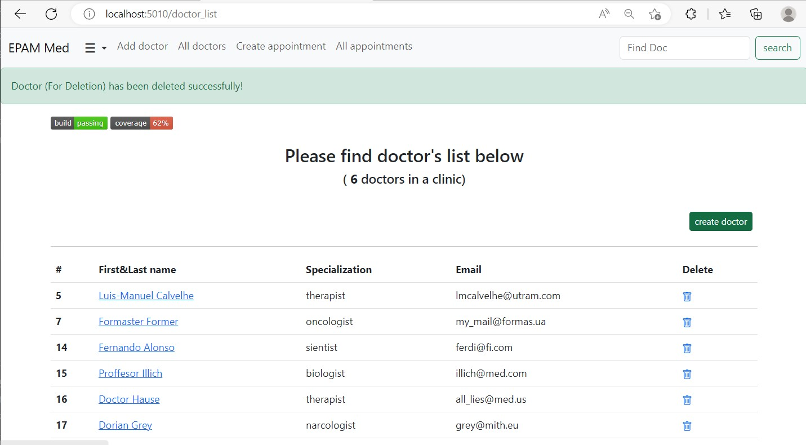  
  
  

# ____ 2. Appointment ____

## 2.1 Display list of Appointments
### This mode is intended for viewing, editing, and deletion of the records list.

### Main scenario:
* User selects the item “All appointments” at the top of the page;
* Application displays in table form the list of all appointments.
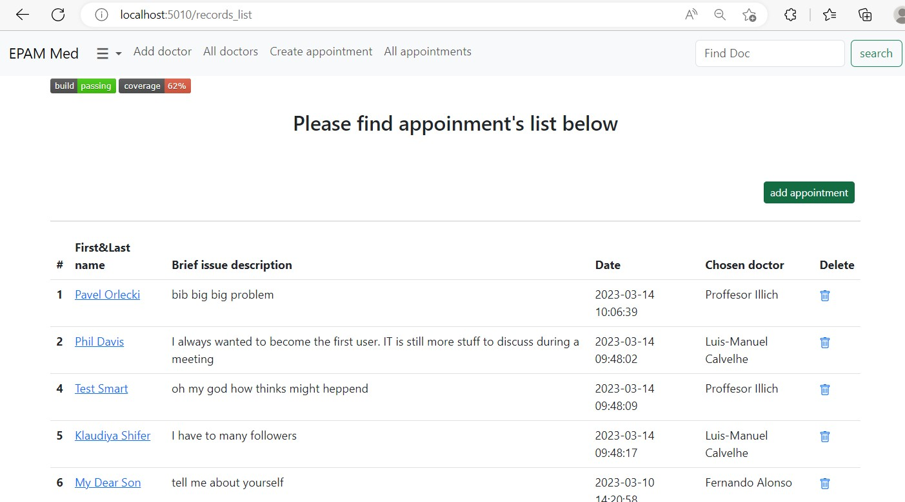 

The list displays the following columns:
* First name – client’s first name;
* Last name – client’s last name;
* Date – appointment registration date;
* Data – brief description of the clients problem;
* Doctor – the doctor, client wants to schedule a meeting with.

## 2.2 Schedule a new appointment  
### Main scenario:
* User clicks the “Add appointment” button in navigation panel;
* Application displays form to enter client data;
* User enters his/her data and presses “Submit” button;
* If any data is entered incorrectly, incorrect data messages are displayed;
* If entered data is valid, then record is adding to database;
* If error occurs, then error message is displaying;
* If new client record is successfully added, then list of clients with added records is displaying.
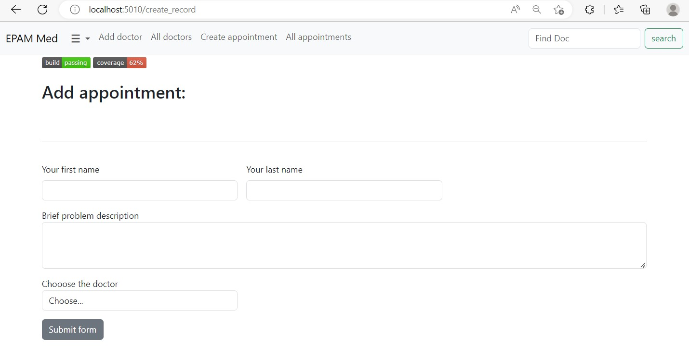 

## 2.3 Edit appointment

### Main scenario: 
* User clicks on the ‘doctor’s name’ link in the appointments list view mode;
* Application displays form to edit appointment data;
* User enters/changes client’s data and presses “Update” button;
* If any data is entered incorrectly, incorrect data messages are displayed;
* If entered data is valid, edited data is added to database and flash message displays;
* If error occurs, then error message is displaying;
* If appointment’s record is successfully edited, then list of clients with modified appointment is displaying.
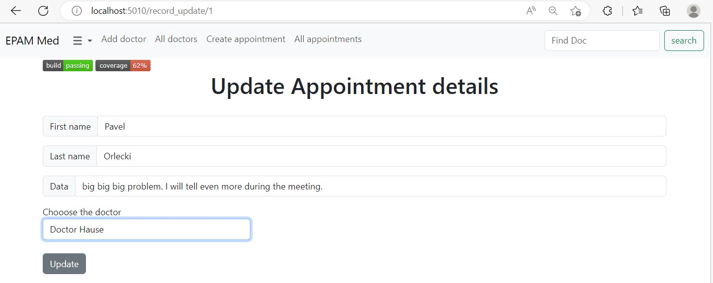 
 

## 2.4 Delete appointment

### Main scenario: 
* The user, while in the list of appointments, presses the "Delete" icon in the selected respective line;
* The user confirms the removal of the appointment by clicking the trash button;
* Appointment object is deleted from database;
* If error occurs, then error message displays;
* If the appointment record is successfully deleted, a flash message about deleting is displayed.
* If the appointment record is successfully deleted, then list of orders without deleted records is displayed.

---

# ____ 3. Search ____

## 3.1 Finding a doctor record

### Main scenario: 
* At any stage of surfing through the app User can jump to the search field to find the doctor(doctors) he saw interested about
* User enters search data and presses “Search” button;
* If at least one result was found app will show us all the records that includes the search parameter.
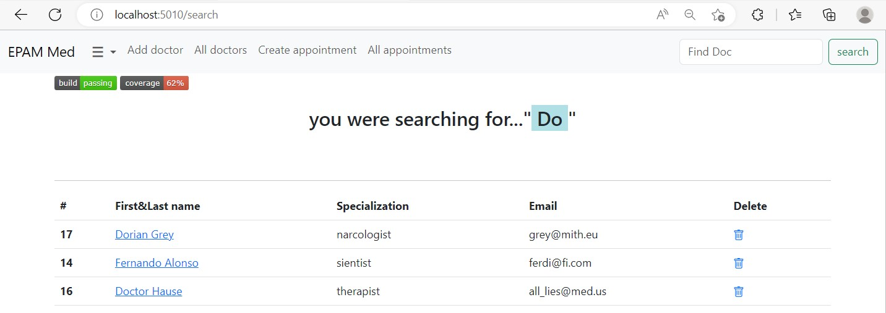
 

## 3.2 No doctor records found

### Main scenario:
if entered pattern doesn't correspond to any of doctors' names - NO result template will be displayed.
flash error message with help information will be shown.
to re-run search simply enter a new data into the search field.

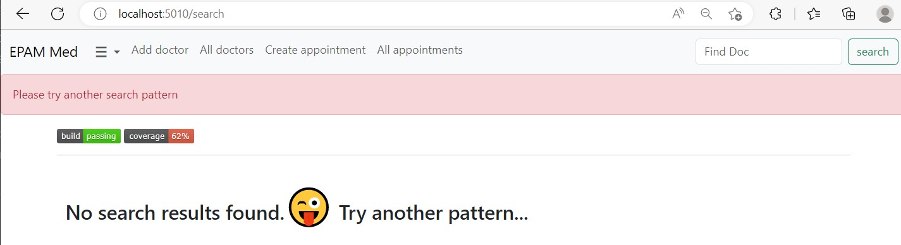  
  
     

# REST **_API_**

 

### _Vision_

#### “Modern Clinic API” allows worldwide applications to sent requests and get response in miliseconds.
  

1. ### GET specific doctor info:
`http://<domain name:port>/api/doctor/<id>` 
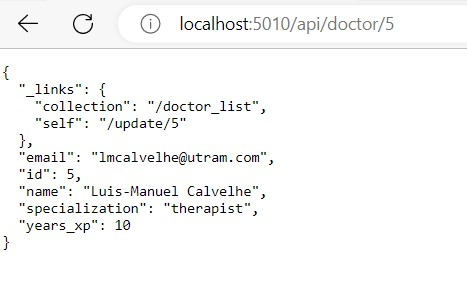
  

2. ### GET information about all doctors:
`http://<domain name:port>/api/doctors` 
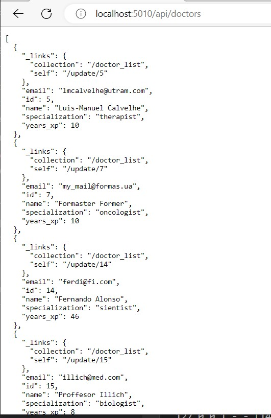

3. ### GET specific record info:
`http://<domain name:port>/api/record/<id>` 
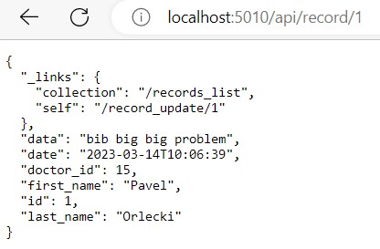
  

4. ### GET information about all records:
`http://<domain name:port>/api/records` 
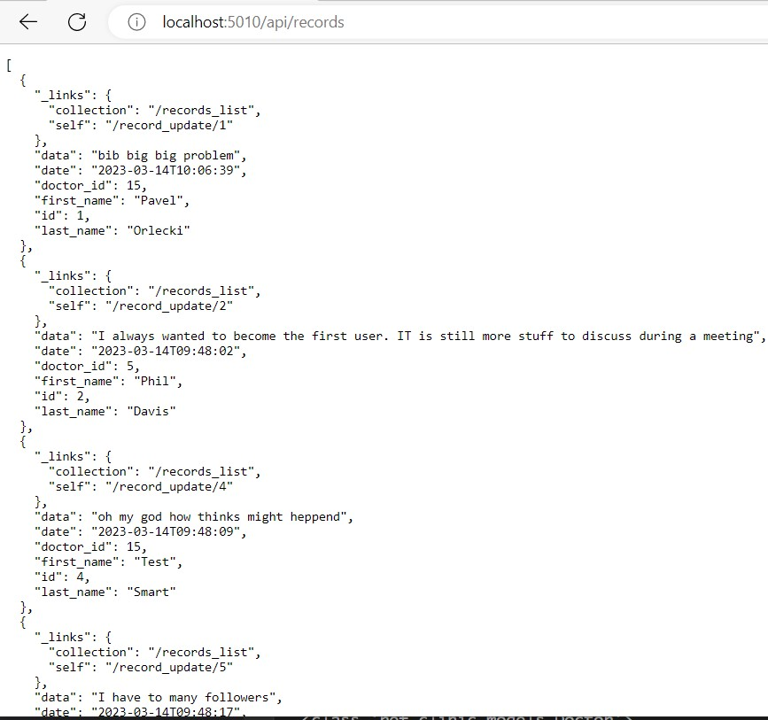
  

5. ### **POST** create doctor:
`http://<domain name:port>/api/add_doctor` 
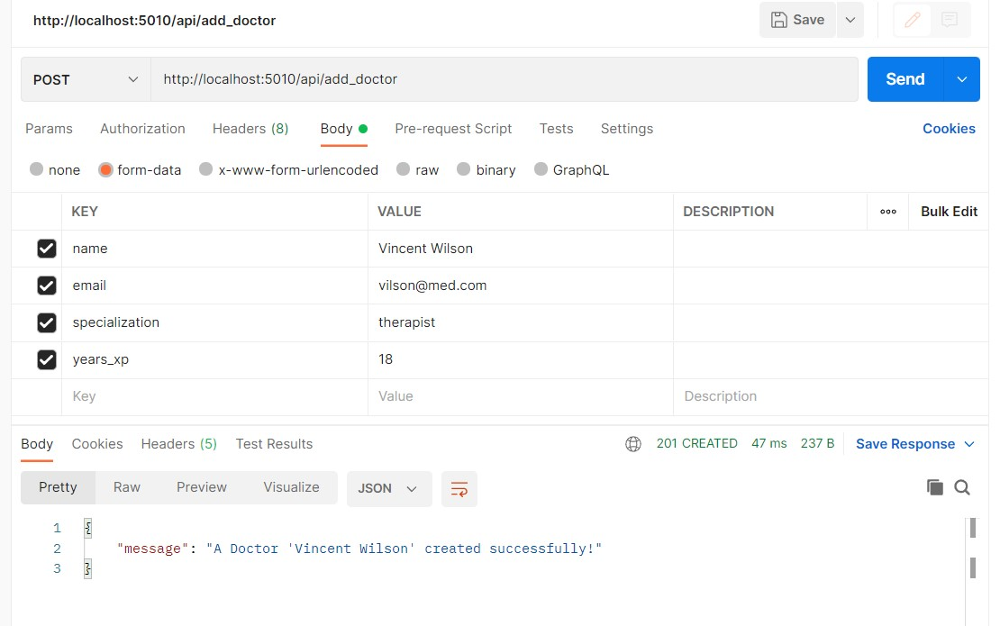
  